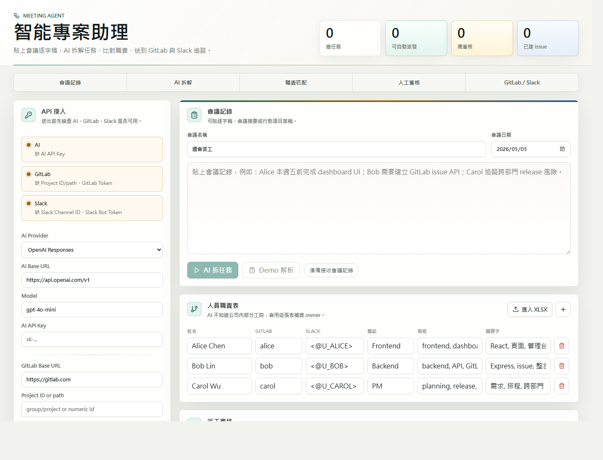

# Smart Project Assistant Agent

Web management console MVP: paste meeting notes or a meeting transcript, let AI extract tasks, route them through an internal responsibility table, create GitLab issues, and send Slack dispatch or reminder messages.

The transcript does not need to directly say "who does what." The agent first extracts work from the discussion, then assigns it by responsibility rules. For example, UI/dashboard work routes to frontend, API/GitLab work routes to backend, and release/cross-team/requirement risk routes to PM or planning owners.

## Product usage guide

完整中文使用教學請看：

- [docs/USAGE.md](docs/USAGE.md)
- [docs/DEPLOYMENT.md](docs/DEPLOYMENT.md)
- [Product deck](docs/product-deck/index.html)

## Screenshots



## Public demo deck

The product deck is hosted with GitHub Pages:

https://ericchen913900.github.io/meeting-agent/

## User-provided API keys

This project does not ship with any API key. Users enter credentials in the Web console:

- AI provider API key
- GitLab personal access token or project access token
- Slack bot token

The backend uses credentials only for the current request. It does not write them to the repo or server files. The browser keeps secret settings in session storage for the current tab session.

## 新手 Token 設定教學

Token 可以理解成「給程式用的密碼」。這個專案需要使用者自己提供三種 token：

| 服務 | 要建立什麼 | 大概長相 | 用途 |
| --- | --- | --- | --- |
| AI provider | API key | `sk-...` 或各家 provider 的 key | 讓 AI 從會議記錄拆任務 |
| GitLab | Personal Access Token | `glpat-...` | 建立與同步 GitLab issue |
| Slack | Bot User OAuth Token | `xoxb-...` | 發送派工與催繳訊息 |

安全規則：

- 不要把真實 token commit 到 GitHub。
- 不要把 token 貼到 Slack 群組。
- 不要把 token 放進截圖。
- token 產生後通常只顯示一次，請先存到安全的密碼管理工具。
- 如果 token 外洩，立刻 revoke / rotate，重新產生新的。

### AI Token

你可以使用 OpenAI、Anthropic / Claude，或公司內部 AI gateway。

#### 選項 A：OpenAI

1. 打開 [OpenAI Platform](https://platform.openai.com/)。
2. 登入帳號。
3. 進入 project settings。
4. 找到 `API Keys`。
5. 點 `Create new secret key`。
6. 立刻複製產生的 key。離開畫面後通常不能再看到完整 key。
7. 貼到本產品的 `AI API Key` 欄位。

本產品建議填：

```text
AI Provider: OpenAI Responses
AI Base URL: https://api.openai.com/v1
Model: gpt-4o-mini
AI API Key: sk-...
```

OpenAI 官方說明：project member 可以建立 project API key，secret key 建立後要立刻安全保存。官方文件：<https://help.openai.com/en/articles/9186755-managing-your-work-in-the-api-platform-with-projects/>

#### 選項 B：Anthropic / Claude

1. 打開 [Claude Console](https://console.anthropic.com/)。
2. 登入帳號。
3. 進入 `Account Settings` 或 `API Keys`。
4. 建立新的 API key。
5. 立刻複製 key。
6. 貼到本產品的 `AI API Key` 欄位。

本產品建議填：

```text
AI Provider: Anthropic Messages
AI Base URL: https://api.anthropic.com
Model: claude-3-5-haiku-latest 或你的帳號可用模型
AI API Key: 你的 Claude API key
```

Anthropic 官方說明：Claude API 需要 Console 產生的 API key。官方文件：<https://platform.claude.com/docs/en/api/overview>

#### 選項 C：公司 AI Gateway

如果公司有提供內部 AI gateway，請填公司給你的值：

```text
AI Provider: Anthropic Messages 或 OpenAI-compatible provider
AI Base URL: 公司 gateway URL
Model: 公司提供的模型名稱
AI API Key: 公司提供的 token
```

不要自行把公司 gateway URL 改成 OpenAI 或 Anthropic 官方 URL，除非管理員明確要求。

### GitLab Token

新手最簡單的做法是建立 GitLab Personal Access Token。

1. 打開 [GitLab](https://gitlab.com/)。
2. 登入帳號。
3. 右上角點你的頭像。
4. 點 `Edit profile`。
5. 左邊選單進入 `Access` > `Personal access tokens`。
6. 點 `Generate token`。如果 GitLab 要你選 token 類型，選 `Legacy token`。
7. Token name 填：

```text
meeting-agent
```

8. Expiration date 選一個到期日，例如 90 天或 180 天。
9. Scope 選：

```text
api
```

10. 點 `Generate token`。
11. 立刻複製 token。GitLab 離開或重新整理頁面後不會再顯示完整 token。
12. 貼到本產品的 `GitLab Token` 欄位。

本產品建議填：

```text
GitLab Base URL: https://gitlab.com
Project ID or path: your-group/your-project
GitLab Token: glpat-...
```

Project path 範例：

```text
ericchen913900-group/ericchen913900-project
```

GitLab 官方說明：Personal Access Token 可以用來呼叫 GitLab API，`api` scope 具備 API 讀寫權限。官方文件：<https://docs.gitlab.com/user/profile/personal_access_tokens/>

### Slack Token

這個產品需要 Slack bot token，不是 Client ID、Client Secret、Signing Secret，也不是 Verification Token。

你要拿到的 token 會長這樣：

```text
xoxb-
```

建立方式：

1. 打開 [Slack API Apps](https://api.slack.com/apps)。
2. 點 `Create New App`。
3. 選 `From scratch`。
4. App name 填：

```text
Meeting Agent
```

5. 選你的 Slack workspace。
6. 左邊選單打開 `OAuth & Permissions`。
7. 找到 `Scopes`。
8. 在 `Bot Token Scopes` 加入：

```text
chat:write
```

9. 點 `Install to Workspace` 或 `Reinstall to Workspace`。
10. 同意安裝。
11. 回到 `OAuth & Permissions`。
12. 複製 `Bot User OAuth Token`。
13. 貼到本產品的 `Slack Bot Token` 欄位。

本產品建議填：

```text
Slack Channel ID: C...
Slack Bot Token: xoxb-...
```

Slack Channel ID 找法：

1. 打開 Slack。
2. 進入你想讓 bot 發訊息的頻道。
3. 點頻道名稱。
4. 打開 `About`。
5. 複製 Channel ID。通常會以 `C` 開頭。

把 bot 加進頻道：

```text
/invite @Meeting Agent
```

如果沒有把 bot 加進頻道，Slack 可能會回 `channel_not_found`，或拒絕送出訊息。

Slack 官方說明：Bot token 會綁定已安裝到 workspace 的 Slack app，並且通常以 `xoxb-` 開頭；`chat:write` scope 讓 app 可以送訊息。官方文件：

- <https://docs.slack.dev/authentication/tokens/>
- <https://docs.slack.dev/reference/scopes/chat.write/>

### Token 要貼到產品哪裡

打開：

```text
http://127.0.0.1:5173
```

在左側 `API 接入` 區塊填：

```text
AI Base URL
Model
AI API Key
GitLab Base URL
Project ID or path
GitLab Token
Slack Channel ID
Slack Bot Token
```

第一次測試請使用測試 GitLab project 和測試 Slack channel。確認訊息格式正確後，再切到正式公司頻道。

## Start

```bash
cd C:\Users\yeee3642\Documents\Playground\meeting-agent
npm install
npm run dev
```

Open:

```text
http://127.0.0.1:5173
```

## Verify

```bash
npm test
npm run typecheck
npm run build
```

## Deploy

For local production mode:

```bash
npm ci
npm run build
HOST=0.0.0.0 PORT=5173 npm run start
```

See [docs/DEPLOYMENT.md](docs/DEPLOYMENT.md) for Windows PowerShell, Render, Railway/Fly style deployment, GitHub Pages deck hosting, and security notes.

## GitLab permissions

The GitLab token needs permission to read users and create issues. Issue creation calls the GitLab Issues API. If username resolution works, the app sends `assignee_ids`. If resolution fails, the issue body still includes `@username`.

## Slack permissions

The Slack bot token needs the `chat:write` scope, and the bot must be in the target channel.

## Implicit-assignment demo input

```text
2026-04-27 product weekly transcript

Host: The dashboard review status is too hard to scan; add badges and GitLab issue links by this Friday.
Engineer: GitLab API error responses are inconsistent. They need one shared response format by next Wednesday.
PM: Release risk across teams needs a plan by 2026-05-08, including Slack announcement wording.
Support: Customer data migration needs legal review by 2026-05-08.
```

Click `Demo Parse`. The first three items route by responsibility table to frontend, backend, and PM/planning. The customer-data/legal item is marked high risk and requires review.

## Responsibility table XLSX import

The Web console can import the first sheet of an `.xlsx` or `.xls` file and replace the current responsibility table.

Recommended headers:

| Header | Required | Example |
| --- | --- | --- |
| `姓名` or `name` | yes | `Alice Chen` |
| `GitLab 帳號` or `gitlabUsername` | yes | `alice` |
| `Slack Mention` or `slackMention` | no | `<@U_ALICE>` |
| `職能` or `role` | no | `Frontend` |
| `負責模組` or `modules` | no | `dashboard, UI` |
| `關鍵字` or `keywords` | no | `React, 管理台` |
| `備援人` or `backupName` | no | `Bob Lin` |

`modules` and `keywords` can be separated by commas, semicolons, Chinese semicolons, ideographic commas, or new lines.

## Current limits

- Meeting input is manual paste only; audio/video transcription is out of scope.
- The personnel responsibility table is maintained in the UI.
- Scheduled Slack reminders are browser-session automation in the current MVP. Production deployment still needs a durable worker, database, and audit log.
- There is no multi-tenant account system or long-term token storage.
- XLSX import uses the `xlsx` package, which currently has npm audit advisories with no npm-provided fix. Keep import to trusted local files.
