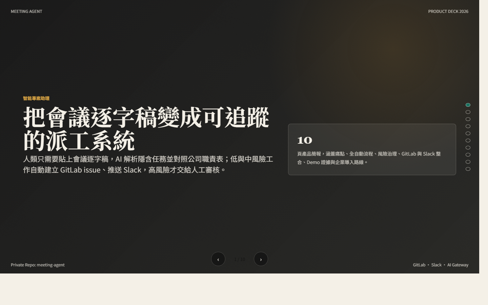

# 部署教學

這份文件教你把智能專案助理 Agent 跑起來、部署到公開可訪問的 Node 服務，並說明 GitHub Pages 簡報的部署方式。

## 1. 專案畫面

Web 管理台：


GitHub Pages 產品簡報：



## 2. 架構說明

這個 repo 有兩種可公開展示的內容：

- 完整產品：React Web 管理台 + Express API，需要 Node 服務，適合部署到 Render、Railway、Fly、VM 或公司內部平台。
- 產品簡報：單一靜態 HTML，已用 GitHub Pages 部署，只展示簡報，不包含 API。

GitHub Pages 網址：

```text
https://ericchen913900.github.io/meeting-agent/
```

完整產品不能只靠 GitHub Pages，因為 GitHub Pages 不能跑 Express API，也不能代送 GitLab / Slack request。

## 3. 本機開發啟動

需求：

- Node.js 20 或更新版本
- npm

指令：

```powershell
git clone https://github.com/ericchen913900/meeting-agent.git
cd meeting-agent
npm install
npm run dev
```

打開：

```text
http://127.0.0.1:5173
```

健康檢查：

```text
http://127.0.0.1:5173/api/health
```

## 4. 本機 production 模式

Windows PowerShell：

```powershell
npm ci
npm run build
$env:NODE_ENV="production"
$env:HOST="0.0.0.0"
$env:PORT="5173"
npm run start
```

Bash / Linux：

```bash
npm ci
npm run build
NODE_ENV=production HOST=0.0.0.0 PORT=5173 npm run start
```

`HOST=0.0.0.0` 是雲端部署常見需求，代表服務會綁在所有網卡。開發模式預設仍是 `127.0.0.1`。

## 5. Render 部署

建立 Render Web Service：

| 欄位 | 值 |
| --- | --- |
| Runtime | Node |
| Build Command | `npm ci && npm run build` |
| Start Command | `npm run start` |
| Health Check Path | `/api/health` |

環境變數：

| Key | Value |
| --- | --- |
| `NODE_ENV` | `production` |
| `HOST` | `0.0.0.0` |

Render 會自動提供 `PORT`，不用手動設定。

## 6. Railway / Fly / VM 部署

通用流程：

```bash
npm ci
npm run build
NODE_ENV=production HOST=0.0.0.0 npm run start
```

平台通常會注入 `PORT`，如果沒有，預設是 `5173`。

VM 或內網主機要確認：

- 防火牆允許目標 port。
- Reverse proxy 有轉發到 Node process。
- 如果走 HTTPS，TLS 應由 proxy 或平台處理。

## 7. GitHub Pages 簡報部署

簡報部署在 `gh-pages` branch 的 root。

來源檔案在主分支：

```text
docs/product-deck/index.html
```

目前 Pages 網址：

```text
https://ericchen913900.github.io/meeting-agent/
```

若更新簡報，流程是：

1. 修改 `docs/product-deck/index.html`。
2. 把最新 HTML 複製到 `gh-pages` branch 的 `index.html`。
3. 推上 `gh-pages`。

## 8. API key 與安全設定

這個專案刻意不把任何 AI / GitLab / Slack token 寫進 repo。

使用者在 Web 管理台自行輸入：

- AI provider API key
- GitLab personal access token 或 project access token
- Slack bot token

目前 MVP 的 token 行為：

- 後端只在當次 request 使用 token。
- 不寫入 repo。
- 不寫入伺服器檔案。
- 瀏覽器只用 session storage 保留目前 tab session。

正式企業部署建議補上：

- SSO / RBAC
- token vault
- database
- audit log
- background worker
- retry / backoff
- admin-visible automation log

## 9. Slack 設定

Slack app 最少需要：

- OAuth scope：`chat:write`
- Bot 已加入目標 channel
- Channel ID，例如 `C0...`

若要真的 tag 人，職責表中的 Slack 欄位請填：

```text
<@U012ABCDEF>
```

不要只填顯示名稱。

## 10. GitLab 設定

GitLab token 需要能建立 issue 並查 project users。

管理台欄位：

- GitLab Base URL：`https://gitlab.com`
- Project ID or path：`group/project`
- GitLab token：使用者自行輸入

如果 GitLab username 無法解析成 project member，issue 仍會建立，但 assignee 可能需要人工補上。

## 11. 驗證部署

部署完成後檢查：

```bash
curl https://YOUR_DOMAIN/api/health
```

預期回應：

```json
{"ok":true}
```

再用瀏覽器開首頁，確認：

- 管理台可以載入。
- 可以貼逐字稿。
- Demo Parse 可以產生任務。
- AI / GitLab / Slack 設定區會顯示缺少欄位。

## 12. 故障排查

### 外部連不到服務

確認 production 啟動時有：

```bash
HOST=0.0.0.0
```

如果只綁 `127.0.0.1`，雲端外部請求通常連不到。

### GitLab issue 建立失敗

檢查：

- token 是否有效
- token scope 是否足夠
- project path 是否正確
- token 使用者是否有專案權限

### Slack 推播失敗

檢查：

- bot token 是否有效
- bot 是否加入 channel
- channel ID 是否正確
- scope 是否包含 `chat:write`

### AI 拆解沒有用真模型

如果沒有填 API key，系統會使用 local demo parser。正式使用前請在管理台填入 provider、base URL、model 與 API key。
